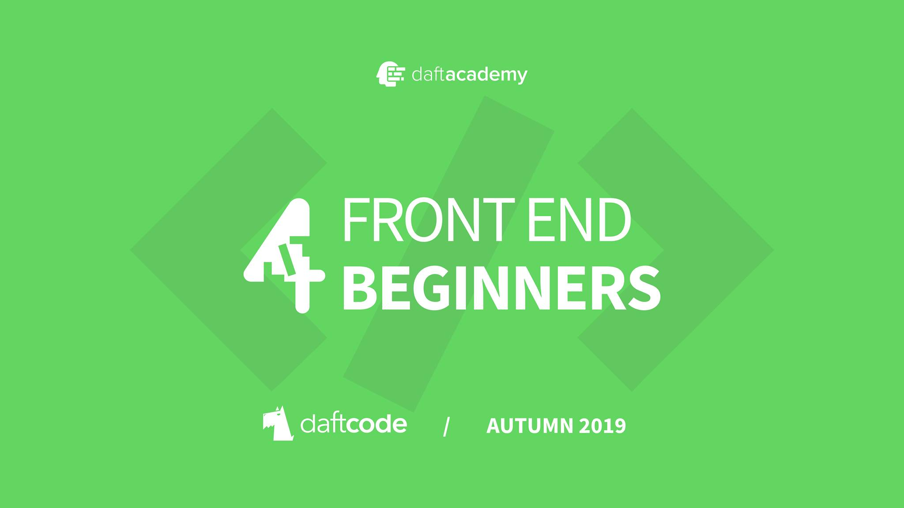
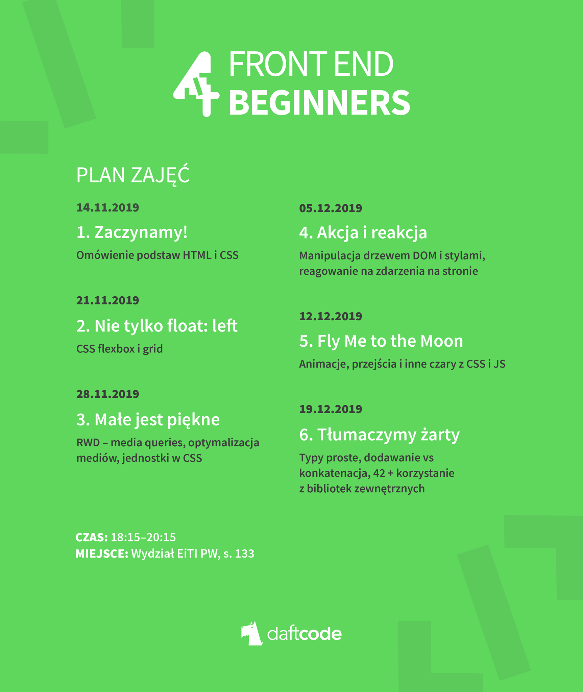

# Front End 4 Beginners

# Plan zajęć

# Materiały z zajęć
Tutaj dzień po zajęciach znajdziecie prezentacje oraz treść zadań domowych.

1. Zaczynamy! ([Prezentacja](assets/Wyklad01_Zaczynamy.pdf))
    - brak pracy domowej po pierwszych zajęciach

2. Nie tylko float: left ([Linki z zajęć](assets/Wyklad02_Nie_tylko_float_left.md))
    - Praca domowa: Bazując na wizualizacji (https://zpl.io/scene/Vx1dY8W) zakoduj warstwę wizualną strony:
        - Wykorzystaj projekt startowy ([link](starter-pack)) jako bazę do zrobienia pracy domowej
        - Zbuduj finalną strukturę wszystkich sekcji strony
            * postaraj się dobrać adekwatną technikę do ułożenia danej sekcji (flexbox, grid, position relative/absolute, inline-block)
        - Zdefiniuj wygląd tekstów na stronie, zwracając uwagę na:
            * Kolor
            * Rozmiar tekstu
            * Pogrubienie lub brak pogrubienia
            * Letter spacing
            * Line-height
            * Opacity
        - Spraw, aby tło strony pozostawało w tym samym miejscu, niezależnie od paska przewijania
            * Do osiągnięcia tego efektu zapoznaj się z właściwością "background-attachment"
            * Pożądany efekt możesz zobaczyć na animacji w materiałach do pracy domowej ([link](https://github.com/daftcode/daftacademy-frontend4beginners-autumn2019/blob/master/README.md#materia%C5%82y-do-projektu))
        - Ostyluj elementy formularza:
            * Przyciski
            * Pola tekstowe
            * Labelki
        - Zadbaj o odpowiednie marginesy i paddingi we wszystkich sekcjach strony (odległości od krawędzi ekranu, odległości nagłówków od treści, itp.)
    - Wyniki pracy domowej ([link](punktacja-pracy-domowej/zadanie01_punktacja.pdf))
    - Przykładowe rozwiązanie ([link](przykladowe-rozwiazania/zadanie01))
3. Małe jest piękne ([Prezentacja](assets/Wyklad03_Male_jest_piekne.pdf))
    - Praca domowa:
        - Umieść w znaczniku `<head>` strony odpowiedni meta tag, aby lepiej wspierać jej wersję mobilną.
        - Zmodyfikuj elementy `` w sekcji 'gallery' tak, aby zaciągały różne wersje pliku w zależności od gęstości pikseli ekranu (DPR) – potrzebne wersje są już w repozytorium ([6BM_zdjecia](assets/6BM_zdjecia.zip)).
        - Skorzystaj z tiny.png, w celu optymalizacji zdjęć sekcji 'concerts' i wykorzystaj zmniejszone wersje w projekcie zamiast oryginalnych.
        - Wykorzystaj @supports w sekcji 'photos' tak, aby korzystać z grida, jeśli przeglądarka go wspiera. Jeśli nie – inne reguły (np. flex) powinny zapewnić wizualnie taki sam efekt.
        - Korzystając z media queries zakoduj wersję designu na telefony o wymiarach 360x640px (np. Samsung Galaxy S5) – strona powinna wyglądać schludnie i spójnie, nie ma konkretnego designu. Główną nawigację ustaw pionowo na górze strony w normalnym flow dokumentu – po kolejnych zajęciach zmienimy ją w wysuwane hamburger menu.
        - CHALLENGE: Zakoduj stronę tak, aby prezentowała się dobrze na wszystkich urządzeniach o szerokościach ekranu od 360px do 1440px.
    - Wyniki pracy domowej ([link](punktacja-pracy-domowej/zadanie02_punktacja.pdf))
    - Przykładowe rozwiązanie ([link](przykladowe-rozwiazania/zadanie02))
4. Akcja i reakcja ([Prezentacja](assets/Wyklad04_Akcja_i_reakcja.pdf))
    - Dodaj hamburger menu do strony dla ekranu 360px - przycisk pokazujący/ukrywający nawigację na szerokości. Menu i przycisk otwierający mogą na razie pozostać nieostylowane, ostylujemy je po kolejnych zajęciach.
    - Napisz funkcję, która po kliknięciu w przycisk "Kup bilet" w sekcji "Concerts" usunie przycisk i w jego miejscu wyświetli tekst "Have fun!"
    - Napisz funkcję, która na evencie "submit" formularza kontaktowego wyloguje wpisane wartości do konsoli. (Podpowiedź: użyj funkcji Object.fromEntries w połączeniu z FormData)

# Informacje organizacyjne

## Komunikacja
Zajęcia są dla Was. Chcemy abyście wyciągneli z nich jak najwięcej. Dlatego przygotowaliśmy dla was dwa kanały komunikacji z nami. Piszcie jeśli macie pytania w sprawie prac domowych oraz wymieniajcie się doświadczeniami na GitHub Issues.
- Email: frontend@daftacademy.pl
- GitHub issues: https://github.com/daftcode/daftacademy-frontend4beginners-autumn2019/issues

## Obecności na zajęciach
Jesteśmy firmą technologiczną, także pozbywamy się papieru i zaznaczmy obecność na zajęciach przez internet.
- Podczas zajęć logujemy się na https://daftacademy.pl/
- W prawym górnym roku klikamy w swoje Imię i Nazwisko
- Wybieramy opcję "Obecność"
- Przepisujemy kod z ekranu projektora

## Edytor kodu

Jeśli nie masz swojego ulubionego to polecamy:

https://code.visualstudio.com/

# Projekt strony internetowej

## Materiały do projektu
- Projekt startowy: [Link](starter-pack)
- Wizualizacja na platformie Zeplin: https://zpl.io/scene/Vx1dY8W
- Zdjęcia i grafiki użyte w wizualizacji: [Link](assets/6BM_zdjecia.zip)
- Teledysk do umieszczenia na stronie https://youtu.be/AstRXh-vKNI (lub własny, jeśli chcecie)
- Animacja prezentująca efekt końcowy pracy domowej po wszystkich zajęciach

## Prace domowe
- Termin oddawania prac domowych - poniedziałek, 23:59 po danych zajęciach
- W celu oddania pracy wypełniamy otrzymany mailowo formularz Google Forms, w którym podajemy swoje dane i link do repozytorium z wykonaną pracą domową
- Kryteria oceny
    ~~~~
    - Punkty bazowe za poprawne wykonanie zadania (maksymalna liczba punktów będzie indywidualna dla każdej pracy domowej)
    - Punkty bonusowe za wysoką jakość kodu (max. 1pkt za pracę domową)
    - Punkty bonusowe za aktywność, przyznawane na koniec kursu (np. udział w dyskusjach i pomoc innym na GitHubie)
    ~~~~

### Wyróżnienie dla najbardziej zaangażowanych osób (certyfikaty ukończenia kursu + gift packi):
- Obecność na minimum 4 z 6 zajęć
- Minimum 70% punktów bazowych za prace domowe

# Umieszczanie pracy domowej na GitHubie

- Zakładamy konto na GitHub.
- Klikamy w prawym górnym rogu `+`
- Wybieramy opcję `New repository`
- Wpisujemy nazwę `daftacademy_frontend4begginers`
- Zaznaczamy pole `Initialize this repository with a README`
- Klikamy `Create repository`

Od teraz wchodząc na nasze repozytorium projektu możemy metodą drag&drop przenosić pliki i wgrywać je do naszego repo.

Każda aktualizacja projektu to tzw. `commit` czyli opis zmian w porównaniu do poprzedniej wersji projektu.

Gotową pracę domową wysyłacie do nas w formularzu Google Forms otrzymanym w mailu po zajęciach.

# Pomoc przy pracach domowych, pytania dotyczące treści zajęć
Zachęcamy do zadawania pytań przez [Issues](https://github.com/daftcode/daftacademy-frontend4beginners-autumn2019/issues) tego projektu. Przeglądajcie również pytania innych uczestników, może potraficie na nie odpowiedzieć! :D

